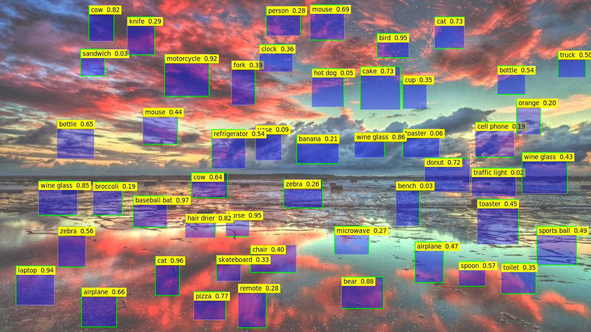

# cuOSD(CUDA On-Screen Display)
Draw all elements using a single CUDA kernel.


# Description

<b>cuOSD</b> supports below pipeline process:

- NV12 Block Linear → In-place OSD (with alpha) → NV12 Block Linear
- NV12 Pitch Linear → In-place OSD (with alpha) → NV12 Pitch Linear
- RGBA → In-place OSD (with alpha) → RGBA

<b>cuOSD</b> supports to draw below elements with user provided attributes:

<table>
<thead>
  <tr>
    <th>Element Type</th>
    <th>Element Attribute</th>
  </tr>
</thead>
<tbody>
  <tr>
    <td>Point</td>
    <td>center x, center y, radius, color</td>
  </tr>
  <tr>
    <td>Line</td>
    <td>start x, start y, end x, end y, line width, color, interpolation</td>
  </tr>
  <tr>
    <td>Circle</td>
    <td>center x, center y, radius, line width, border color, background color</td>
  </tr>
  <tr>
    <td>Rectangle</td>
    <td>left, top, right, bottom, line width, border color, background color</td>
  </tr>
  <tr>
    <td>Rotated Rectangle</td>
    <td>center x, center y, width, height, yaw, line width, color</td>
  </tr>
  <tr>
    <td>Arrow</td>
    <td>start x, start y, end x, end y, arrow size, line width, color, interpolation</td>
  </tr>
  <tr>
    <td>Text</td>
    <td>left upper x, left upper y, utf-8 text, font size, border color, background color</td>
  </tr>
  <tr>
    <td>Clock</td>
    <td>left upper x, left upper y, format, time, font size, border color, background color</td>
  </tr>
  <tr>
    <td>rgba source</td>
    <td>center x, center y, width, height, device buffer in rgba</td>
  </tr>
  <tr>
    <td>nv12 source</td>
    <td>center x, center y, width, height, device buffer in nv12, mask color, block linear</td>
  </tr>
</tbody>
</table>

* yaw: rotation angle from y-axis, clockwise +, unit in rad.

# Getting started

Text drawing can use either online and offline way to generate text bitmap.
- <b>Online</b>: Search for the TTF file among the system directory with specified font name, then use stb_truetype library to generate bitmap.
- <b>Offline</b>: Generate customized nvfont files with predefined character scope and font size, then load nvfont file during cuOSD initialization.

To run cuOSD demo tests
```
$ cd cuOSD && make run
$ ./cuosd --help
Usage:
     ./cuosd simple
     ./cuosd comp --line
     ./cuosd perf --input=3840x2160/BL --font=data/my.nvfont --line=100 --rotatebox=100 --circle=100 --rectangle=100 --text=100 --arrow=100 --point=100 --clock=100 --save=output.png --seed=31
     ./cuosd perf --input=1280x720/BL --font=data/my.nvfont --load=data/std-random-boxes.txt --save=output.png --seed=31

Command List:
  ./cuosd simple
    Simple image rendering and save result to jpg file.


  ./cuosd comp --line
    Benchmark test of drawing 100 lines using the same configuration as nvOSD.


  ./cuosd perf --input=3840x2160/BL --font=data/my.nvfont --line=100 --rotatebox=100 --circle=100 --rectangle=100 --text=100 --arrow=100 --point=100 --clock=100 --save=output.png --seed=31
  ./cuosd perf --input=1280x720/BL --font=data/my.nvfont --load=data/std-random-boxes.txt --save=output.png --seed=31
    Perf test for given config.

    Prameters:
    --input:  Set input size and format, Syntax format is: [width]x[height]/[format]
              format can be 'BL', 'PL', 'RGBA'
    --load:      Load elements from file to rendering pipeline.
    --line:      Add lines to rendering pipeline
    --rotatebox: Add rototebox to rendering pipeline
    --circle:    Add circles to rendering pipeline
    --rectangle: Add rectangles to rendering pipeline
    --text:      Add texts to rendering pipeline
    --arrow:     Add arrows to rendering pipeline
    --point:     Add points to rendering pipeline
    --clock:     Add clock to rendering pipeline
    --save:      Sets the path of the output. default does not save the output
    --font:      Sets the font file used for text contexting.
    --fix-pos:   All elements of the same kind use the same coordinates, not random
    --seed:      Set seed number for random engine
```

# For Python Interface
- Compile the pycuosd.so
```bash
$ make pycuosd
$ python test/pytest.py
OpenCV 971.628 ms
cuOSD 222.903 ms
Save result to output.png
```

# Demo

Draw 50 rectangles and 50 texts with background color on 1280x720/BL input, takes 1033.72 us on Jetson-Orin, JP-5.0.2 GA.


# Performance Table

<table>
<thead>
  <tr>
    <th>Environment</th>
    <th colspan="4">Jetson-AGX Orin 64GB, JP-5.0.2 GA, BATCH=1, CPU@2201.6MHz, GPU@1300MHz, EMC@3199MHz, VIC@729.6MHz</th>
  </tr>
</thead>
<tbody>
  <tr>
    <td>Description</td>
    <td colspan="4">CLs for performance test: </td>
  </tr>
  <tr>
    <td>SDK</td>
    <td colspan="3">cuOSD</td>
    <td colspan="1">nvOSD</td>
  </tr>
  <tr>
    <td>Image Format</td>
    <td>1920x1080/BL</td>
    <td>1920x1080/PL</td>
    <td>1920x1080/RGBA</td>
    <td>1920x1080/RGBA</td>
  </tr>
  <tr>
    <td>100 Rect [us]</td>
    <td>598.81</td>
    <td>598.99</td>
    <td>616.60</td>
    <td>24947(VIC)/2321(CPU)</td>
  </tr>
  <tr>
    <td>100 Text [us]</td>
    <td>935.02</td>
    <td>934.92</td>
    <td>967.30</td>
    <td>6945 (CPU)</td>
  </tr>
  <tr>
    <td>100 Line [us]</td>
    <td>263.41</td>
    <td>263.25</td>
    <td>270.68</td>
    <td>2586(CPU)</td>
  </tr>
  <tr>
    <td>100 Circle [us]</td>
    <td>226.71</td>
    <td>226.86</td>
    <td>230.15</td>
    <td>14474(CPU)</td>
  </tr>
  <tr>
    <td>100 Arrow [us]</td>
    <td>520.76</td>
    <td>521.06</td>
    <td>534.42</td>
    <td>3855(CPU)</td>
  </tr>
</tbody>
</table>
